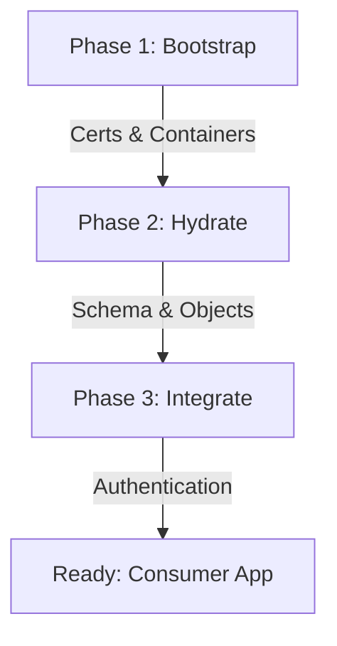

# EIP Platform - Initialization & Lifecycle Guide

This document describes the three-phase lifecycle used to provision, hydrate, and integrate database silos and messaging services within the EIP Core Platform.

## 1. Lifecycle Overview

The platform uses a modular startup sequence to ensure that security (certificates), infrastructure (containers), and data (schemas) are synchronized before the application connects.

---

## 2. Phase 1: Infrastructure Bootstrapping
**Tools**: `generate-certs.sh`, `infra.sh`

In this phase, the system builds the "empty shell" of the environment:
1.  **Certificate Generation**: The `generate-certs.sh` script creates a localized PKI (Root CA, Server/Client Certs, and PKCS12 Stores) in the `initialization/<silo>/certs` directory.
2.  **Container Provisioning**: The `infra.sh` script triggers `docker compose` to pull the appropriate image (e.g., Oracle 23c, SQL Server 2022) and mount the certificates as persistent volumes.

## 3. Phase 2: Database Hydration (Schema Injection)
**Tools**: `initialize.sh`, `Liquibase`

Once the container is running, the hydration phase begins:
1.  **Readiness Check**: The `initialize.sh` script polls the containerized service (e.g., waiting for `FREEPDB1` in Oracle or `master` in SQL Server) to ensure the service is fully "READY" to accept connections.
2.  **Database Migration**: The script triggers a standalone **Liquibase module**. This module reads YAML/SQL changelogs from the `audit/init/liquibase/` directory and applies them to the target database to create the `AUDIT_LOG` tables and other necessary objects.

## 4. Phase 3: Application Integration
**Tools**: `.env` Metadata, `Quarkus Agroal`

The final phase connects the application shell to the provisioned infrastructure:
1.  **Metadata Injection**: The application module loads silo-specific metadata from `config/assets/envs/audit-<silo>.env`.
2.  **Authentication**: All sensitive details (Username, Password, JDBC URL) are injected purely via environment variables. The application code remains immutable and never contains hardcoded credentials.
3.  **Discovery**: By toggling the `EIP_AUDIT_DB_TYPE` variable, the platform dynamically switches its routing logic to the appropriate database sink.

---

## 5. Summary of Roles

| Layer | Responsibility | Primary Tool |
|---|---|---|
| **Operations** | Infra & Security | Docker Compose / OpenSSL |
| **Data** | Schemas & Validations | Liquibase |
| **Logic** | Message Routing & Delivery | Quarkus / Camel |
