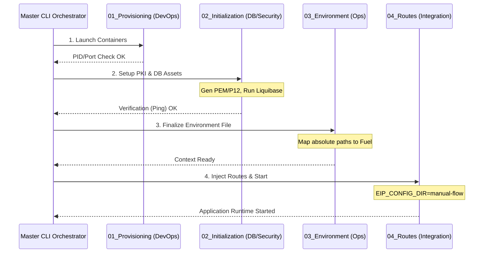

# Architectural Blueprint: Modular Environment Orchestration

This plan outlines the restructuring of the EIP Platform environment setup into a "Team-Based" modular pipeline. Each layer is independent, verifiable, and loosely coupled via environment variables.

## 1. Pipeline Sequence Visualization



## 2. Modular Directory Structure

```text
/home/pratyush/software/eip-core-integration/eip-core-environment/demo/mongodb/
├── 01_provisioning/         # TEAM: DevOps
│   └── docker-isolated.yaml # Starts raw containers
├── 02_initialization/       # TEAM: DB & Security
│   ├── certs/               # PKI (PEM, PKCS#8, P12)
│   ├── liquibase/           # Schema (Collections/Indexes)
│   └── setup.sh             # Logic: Generate certs -> Apply Liquibase -> Ping Test
├── 03_environment/          # TEAM: Ops
│   ├── profiles/            # non-ssl.env, ssl.env, mtls.env
│   └── load_env.sh          # Logic: Map static files to ENV vars
└── 04_routes/               # TEAM: Integration (Externalized)
    └── sample-flow/         # Kaoto YAML definitions
```

## 2. Multi-Stage Orchestration Pipeline

The main entry point (CLI) will follow this sequence:

### Phase 1: Provisioning (DevOps)
*   **Action**: `docker compose up -d`
*   **Goal**: Ensure ports 27017, 9092, etc., are listening.
*   **Verification**: TCP port check.

### Phase 2: Initialization (Security/DB)
*   **Action**: Generate environment-specific certificates.
*   **Action**: Run Liquibase to ensure the database objects exist.
*   **Verification**: `mongosh` ping with provided certificates.

### Phase 3: Environment Setup (Ops)
*   **Action**: Source the correct `.env` profile.
*   **Action**: Replace absolute paths in variables using current `$PWD`.
*   **Goal**: Create a complete environment variable context.

### Phase 4: Integration Execution (Dev)
*   **Action**: Accept dynamic `EIP_CONFIG_DIR` from the CLI.
*   **Action**: Start `eip-core-consumer`.

## 3. Key Advantages

1.  **Isolation**: Infrastructure teams can iterate on `01_provisioning` (e.g., switching to Podman or Kubernetes) without breaking the `04_routes`.
2.  **Externalized Business Logic**: Routes are treated as "fuel" and are not locked into the environment configuration.
3.  **Strict Security Hand-off**: The `02_initialization` stage is the only place where private keys are generated, preventing security leaks into provisioning scripts.

## 5. Pipeline Verification Workflow

To test a specific scenario (e.g., MongoDB mTLS), you will run the master CLI:

```bash
./start-eip.sh --scenario mtls-mongo --routes ./demo/mongodb/routes/ssl-mtls
```

### Execution Trace (Expected Output):
1.  **[PROVISIONING]**: Shows `docker compose` logs starting the mongo image.
2.  **[INITIALIZATION]**: 
    - console log: `>>> Generating PKCS#8 and P12 certificates...`
    - console log: `>>> Applying Liquibase changeset: initial_schema.yaml...`
    - console log: `>>> VERIFICATION: mongosh ping SUCCESSFUL.`
3.  **[ENVIRONMENT]**: 
    - console log: `>>> Using Profile: ssl-mtls.env`
    - console log: `>>> EIP_CERT_DIR mapped to: /abs/path/02_initialization/certs`
4.  **[RUNTIME]**: 
    - console log: `>>> Starting Quarkus Consumer...`
    - console log: `>>> Camel Context started with 1 route (manual-flow).`
